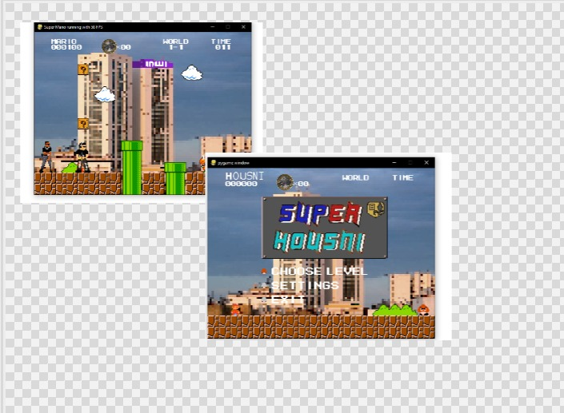
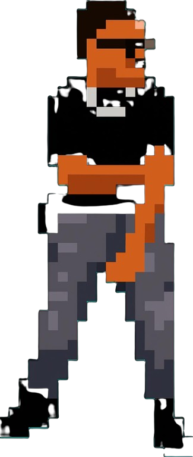

# README.md for Super Houssni Game

```markdown
# 🍄 Super Houssni Game - ULTRA CRAZY EDITION 🎮

[](https://www.python.org/)
[](https://www.pygame.org/)
[](LICENSE)

A crazy, fun-filled 2D platformer game inspired by classic arcade games, built with Python and Pygame! This project combines retro gaming nostalgia with modern programming techniques.

## 🎯 About the Project

Super Houssni Game is an educational project developed by students to learn:
- **Object-Oriented Programming** principles
- **Game development** fundamentals
- **Python programming** best practices
- **Team collaboration** using Git

### 🎮 Game Features
- Classic platformer gameplay with a modern twist
- Multiple levels with increasing difficulty
- Coin collection system and score tracking
- Enemy AI with different behavior patterns
- Smooth animations and responsive controls
- Retro-style graphics and sound effects

## 🚀 Quick Start

### Prerequisites
- Python 3.8 or higher
- Pip package manager

### Installation & Running

1. **Clone the repository**
   ```bash
   git clone https://github.com/carlos05d/SUPER-HOSSNI-GAME.git
   cd SUPER-HOSSNI-GAME
   ```

2. **Install dependencies**
   ```bash
   pip install -r requirements.txt
   ```

3. **Run the game**
   ```bash
   python main.py
   ```

### 🏗️ Standalone Windows Build

To create a standalone executable for Windows:

1. **Install py2exe**
   ```bash
   pip install py2exe
   ```

2. **Build the executable**
   ```bash
   python compile.py py2exe
   ```

The executable will be created in the `dist` folder.

## 🎯 Controls

| Action | Key | Description |
|--------|-----|-------------|
| Move Left | `←` or `A` | Move character to the left |
| Move Right | `→` or `D` | Move character to the right |
| Jump | `SPACE` | Make the character jump |
| Boost | `SHIFT` | Temporary speed boost |
| Secret Action | `Left/Right Mouse Click` | Discover hidden features! |
| Pause | `P` or `ESC` | Pause the game |

## 📸 Current Game State



*Experience the ULTRA CRAZY gameplay with smooth animations and challenging levels!*

## 🛠️ Dependencies

The project uses the following main dependencies:

| Package | Version | Purpose |
|---------|---------|---------|
| **pygame** | >= 2.0.0 | Game development framework |
| **scipy** | >= 1.7.0 | Scientific computing for advanced features |

### Complete requirements:
```txt
pygame>=2.0.0
scipy>=1.7.0
numpy>=1.21.0
```

## 🏗️ Project Structure

```
SUPER-HOSSNI-GAME/
├── main.py                 # Main game entry point
├── compile.py              # Build script for py2exe
├── requirements.txt        # Python dependencies
├── README.md              # Project documentation
├── img/                   # Game assets and screenshots
│   └── rtn.jpg           # Current game screenshot
├── src/                   # Source code modules
│   ├── player.py         # Player character class
│   ├── enemy.py          # Enemy AI and behavior
│   ├── level.py          # Level design and management
│   ├── physics.py        # Collision detection and physics
│   └── audio.py          # Sound effects and music
└── assets/               # Game resources
    ├── sprites/          # Character and object sprites
    ├── sounds/           # Audio files
    └── levels/           # Level data files
```

## 🎮 Gameplay Features

### Core Mechanics
- **Platform Navigation**: Jump between platforms and avoid obstacles
- **Coin Collection**: Gather coins to increase your score
- **Enemy Avoidance**: Dodge or defeat enemies to survive
- **Power-ups**: Collect special items for temporary abilities
- **Score System**: Compete for high scores

### Level Design
- Progressive difficulty curve
- Hidden areas and secrets
- Multiple paths and strategies
- Boss battles (in development)

## 🤝 Contribution

We welcome contributions from the community! Whether you're a beginner or an experienced developer, there are many ways to help improve Super Houssni Game.

### How to Contribute

1. **Fork the repository**
2. **Create a feature branch**
   ```bash
   git checkout -b feature/amazing-feature
   ```
3. **Commit your changes**
   ```bash
   git commit -m 'Add some amazing feature'
   ```
4. **Push to the branch**
   ```bash
   git push origin feature/amazing-feature
   ```
5. **Open a Pull Request**

### Areas Needing Improvement
- Code refactoring and optimization
- Additional level designs
- New enemy types and behaviors
- Enhanced graphics and animations
- Sound effects and background music
- Bug fixes and performance improvements

### Getting Help
If you have any questions, ideas, or need help getting started:
- Open an **Issue** on GitHub
- Contact the maintainers directly
- Check the project's **Wiki** for documentation

## 📝 Code Quality

The project follows these coding standards:
- **PEP 8** Python style guide
- **Object-Oriented Design** principles
- **Modular architecture** for easy maintenance
- **Comprehensive comments** and documentation

## 🐛 Known Issues

- Some collision detection edge cases
- Performance optimization needed for certain levels
- Audio loading delays on slower systems

## 🔮 Future Plans

- [ ] Multiplayer support
- [ ] Level editor
- [ ] Mobile version
- [ ] Online leaderboards
- [ ] Additional game modes

## 📄 License

This project is licensed under the MIT License - see the [LICENSE](LICENSE) file for details.

## 👥 Development Team

- **Carlos** - Project Lead & Main Developer
- **Houssni** - Game Design & Creative Director
- **Team Members** - Additional contributors

## 🙏 Acknowledgments

- Inspired by classic platformer games
- Built with the amazing Pygame community
- Thanks to all our testers and contributors
- Special thanks to our mentors and teachers

---

**⭐ If you enjoy this project, please give it a star on GitHub!**

**🎮 Happy gaming and happy coding!**
```

